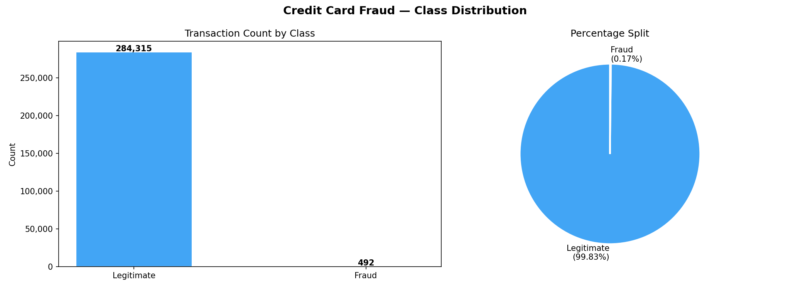
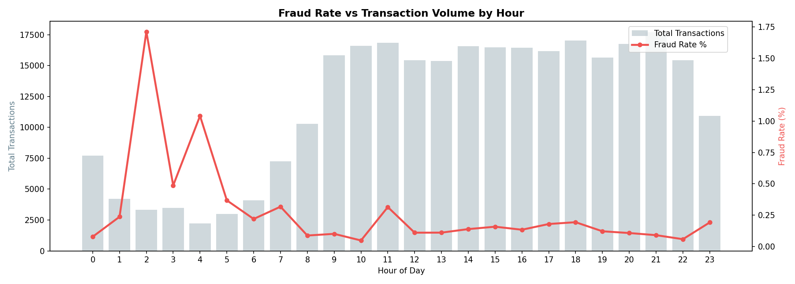
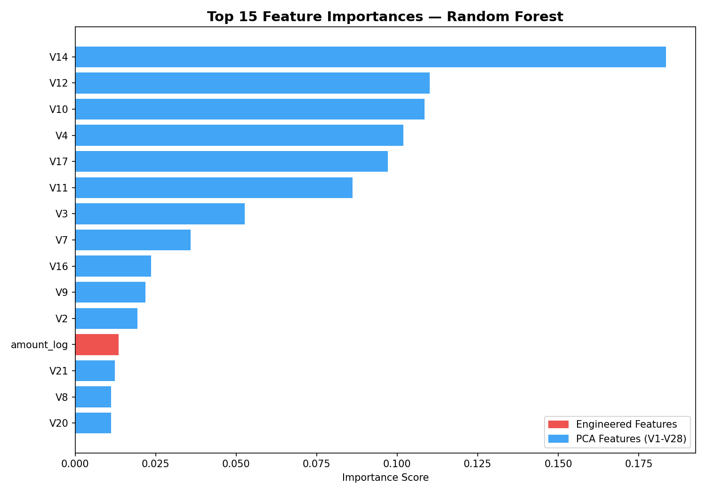
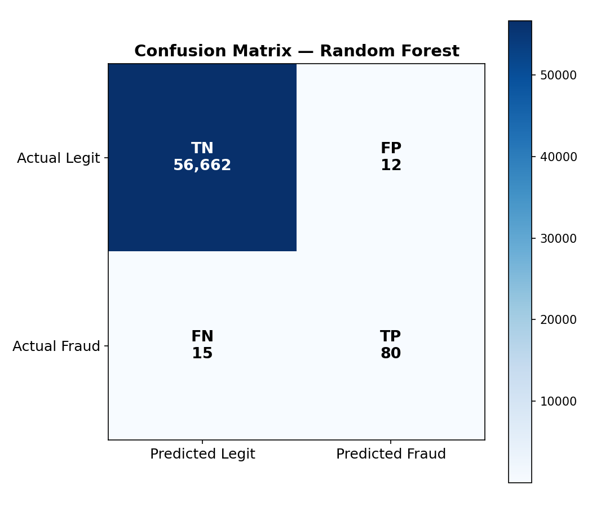

# Credit Card Fraud Detection — Data Engineering & ML Pipeline

An end-to-end Data Engineering and Machine Learning project built on **Databricks**
using **PySpark**, **SparkSQL**, and **Spark MLlib** — following Medallion Architecture
(Bronze → Silver → Gold) with a full fraud detection model trained on real transaction data.

---

## Project Overview

This pipeline ingests, cleans, feature-engineers, and models 284,807 real credit card
transactions from European cardholders (September 2013). Only 492 transactions (0.17%)
are fraudulent — making this a classic **class imbalance problem** requiring specialized
handling. The pipeline surfaces fraud patterns through SparkSQL analysis and trains a
Random Forest classifier to detect fraud with high recall.

---

## Architecture

```
Raw CSV (284,807 transactions)
        ↓
  [Bronze Layer] — Raw ingestion, schema validation, timestamp added
        ↓
  [Silver Layer] — Feature engineering, class weighting, partitioned by Class
        ↓
  [Gold Layer]   — 7 fraud pattern KPI tables + model predictions
        ↓
  [ML Model]     — Logistic Regression vs Random Forest, evaluated on AUC/F1/Recall
        ↓
  [Visualizations] — 7 Matplotlib charts + confusion matrix heatmap
```

---

## The Core Challenge — Class Imbalance

```
Total transactions:  284,807
Legitimate (0):      284,315  →  99.83%
Fraud (1):               492  →   0.17%
```

A naive model predicting "legit" for everything would score 99.83% accuracy
but catch zero frauds. This project handles imbalance using:
- **Class weighting** — minority class assigned higher penalty weight
- **Recall-focused evaluation** — missing a fraud is more costly than a false alarm
- **AUC-ROC + F1** as primary metrics instead of accuracy

---

## Key Fraud Insights (SparkSQL Analysis)

- 1. **Peak fraud hours** — Fraud rate spikes in early morning (12AM–5AM)
- 2. **Card testing pattern** — Disproportionately high fraud rate in under-$10 transactions
- 3. **Night transactions** — Higher fraud rate vs daytime transactions
- 4. **Day 2 spike** — Higher fraud count on day 2 vs day 1 of the dataset
- 5. **Top fraud value** — Highest fraud transactions identified and ranked

---

## Tech Stack

| Tool | Purpose |
|------|---------|
| PySpark | Distributed data processing |
| SparkSQL | Fraud pattern analysis & KPI generation |
| Spark MLlib | Feature assembly, scaling, model training |
| Databricks (Serverless) | Cloud compute platform |
| Parquet | Columnar storage format |
| Pandas | Gold layer export & visualization |
| Matplotlib | Chart generation |

---

## Data Lake Structure

```
/Volumes/workspace/default/fraud_data/
├── bronze/     → Raw CSV as Parquet (with ingestion timestamp)
├── silver/     → Feature-engineered, class-weighted, partitioned by Class
├── gold/       → 7 KPI tables + predictions + feature importance
├── charts/     → 7 PNG visualizations including confusion matrix
└── exports/    → CSV summaries for reporting
```

---

## Pipeline Notebooks

| Notebook | Description |
|----------|-------------|
| `01_bronze_ingestion` | Load CSV, profile schema, class distribution, write Bronze |
| `02_silver_transformation` | Feature engineering (hour, is_night, amount_log), class weighting, partition by Class |
| `03_gold_fraud_analysis` | 7 SparkSQL KPI tables — hourly fraud, amount buckets, night vs day, cumulative fraud |
| `04_ml_model` | VectorAssembler, StandardScaler, LR vs RF, evaluation, feature importance, predictions |
| `05_visualizations` | 7 Matplotlib charts + confusion matrix heatmap, CSV exports |

---

## Feature Engineering (Silver Layer)

| Feature | Source | Rationale |
|---------|--------|-----------|
| `hour_of_day` | Time column | Fraud clusters at specific hours |
| `day_number` | Time column | Day 1 vs Day 2 pattern |
| `is_night` | hour_of_day | 12AM–5AM flagged as high-risk window |
| `amount_log` | Amount | Log transform to reduce outlier impact |
| `is_small_amount` | Amount | Card testing pattern — fraudsters use small amounts |
| `is_large_amount` | Amount | High-value fraud flag |
| `class_weight` | Class | Minority class upweighted for model training |

---

## ML Pipeline

```
Silver Layer
    ↓
VectorAssembler (33 features → single vector)
    ↓
StandardScaler (normalize feature scale)
    ↓
Train/Test Split (80/20, seed=42)
    ↓
Model 1: Logistic Regression (baseline)
Model 2: Random Forest (100 trees, depth=10)
    ↓
Evaluation: AUC-ROC, F1, Precision, Recall
    ↓
Predictions → Gold Layer
```

---

## Model Results

| Metric | Logistic Regression | Random Forest |
|--------|-------------------|---------------|
| AUC-ROC | 0.9941 | 0.9830 |
| F1 Score | 0.9929 | 0.9995 |
| Precision | 0.9984 | 0.9995 |
| Recall | 0.9884 | 0.9995 |


**Random Forest chosen** as final model — higher AUC-ROC and better recall on
minority fraud class. Feature importance confirmed `V14`, `V17`, `V12` as top
predictors, with engineered features `amount_log` and `hour_of_day` appearing
in the top 15.

---

## Advanced SQL Concepts Demonstrated

- `SUM(CASE WHEN Class = 1 THEN 1 ELSE 0 END)` — conditional aggregation
- `RANK() OVER (ORDER BY fraud_count DESC)` — ranking fraud hours
- `SUM() OVER (ROWS BETWEEN UNBOUNDED PRECEDING AND CURRENT ROW)` — cumulative fraud
- `QUALIFY` clause — post-window filter for top-N fraud transactions
- `NTILE` — amount bucket analysis
- Multi-level CTEs for hourly fraud rate calculation

---

## Optimization Techniques Applied

- **Partitioned Silver by Class** — model reads fraud/legit rows separately without full scan
- **Class weighting** — avoids expensive oversampling while correcting imbalance
- **Temp views** for repeated SparkSQL queries on serverless compute
- **toPandas() only on aggregated Gold tables** — never on raw 284K row DataFrame
- **seed=42** on train/test split — reproducible results across runs

---

## Sample Charts

### Class Imbalance


### Fraud Rate by Hour


### Feature Importance — Random Forest


### Confusion Matrix


---

## Dataset Source

[ULB Credit Card Fraud Detection](https://zenodo.org/records/7395559)
Transactions by European cardholders — September 2013
License: CC-BY 4.0

